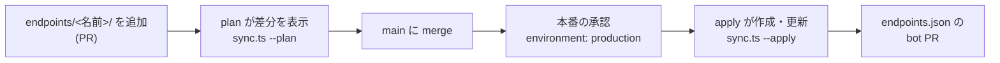
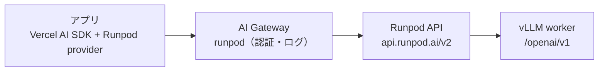
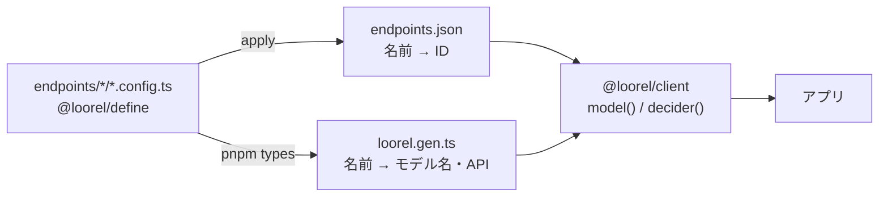
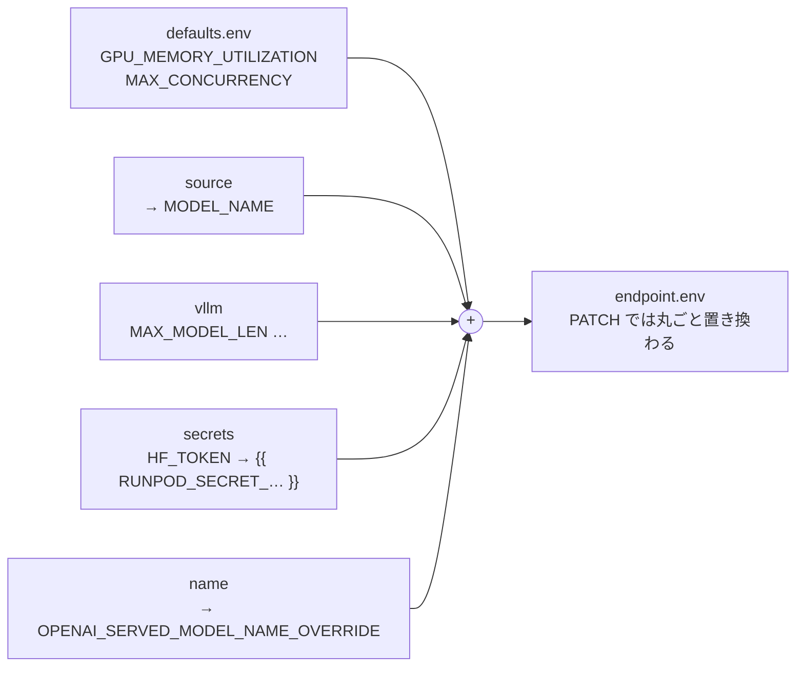
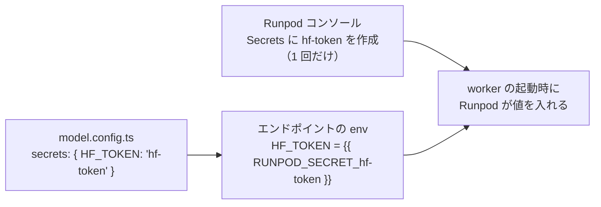

<div align="center">

# Loorel（ルーレル）

**ディレクトリを 1 つ足すと、GPU エンドポイントができる。**

`endpoints/<名前>/` に TypeScript で書いた定義を Runpod Serverless の vLLM エンドポイントに反映し、<br>
アプリからは Cloudflare AI Gateway 経由で呼び出します。

[Quickstart](#quickstart) · [Why](#why-loorel) · [しくみ](#しくみ) · [リファレンス](#リファレンス) · [FAQ](#よくある質問) · [ロードマップ](#ロードマップ)

`preview` · 実装 10 / 10（実 API での動作確認待ち）

</div>

<table>
<tr>
<th>endpoints/qwen3-8b/</th>
<th>pnpm plan</th>
</tr>
<tr>
<td>

```ts
// model.config.ts
export default defineModel({
  name: "qwen3-8b",
  source: "Qwen/Qwen3-8B",
  vllm: { MAX_MODEL_LEN: 8192 },
});

// endpoint.config.ts
export default defineEndpoint({
  model, // ./model.config.ts
  gpu: { pools: ["ADA_24"], count: 1 },
  workers: { min: 0, max: 2 },
});
```

</td>
<td>

```diff
+ create qwen3-8b
+     image: "runpod/worker-v1-vllm:v2.27.2"
+     env.MODEL_NAME: "Qwen/Qwen3-8B"
+     env.MAX_MODEL_LEN: "8192"
+     gpu: {"pools":["ADA_24"],"count":1}
+     workers: {"min":0,"max":2}
```

</td>
</tr>
</table>

## Why Loorel

GPU の設定をコンソールで手作業するかわりに、リポジトリのファイルを正解にします。

|                 | 特長                         | 内容                                                                                                           |
| --------------- | ---------------------------- | -------------------------------------------------------------------------------------------------------------- |
| `diff`          | **変更は PR で読める**       | plan が Runpod の今の状態と定義を比べ、変わる項目だけを Markdown で出します。PR コメントにそのまま貼れる形です |
| `$0.00 / idle`  | **使わない間は課金されない** | `workers.min: 0` が標準です。リクエストが来たときだけ GPU が起動し、5 秒使われなければ止まります               |
| `no state file` | **状態ファイルを持たない**   | エンドポイントを名前で探し、なければ作成、あれば更新します。Terraform の state のような管理物はありません      |
| `1 gateway`     | **入口は Gateway ひとつ**    | アプリは AI Gateway の URL だけを知っていれば動きます。認証・ログ・利用上限は Gateway 側でまとめて扱えます     |

## しくみ

### 反映の流れ



| #   | ステップ                                 | 状態                 |
| --- | ---------------------------------------- | -------------------- |
| 1   | `endpoints/<名前>/` を追加して PR を作る | ✅ 動く              |
| 2   | plan が差分を表示（`sync.ts --plan`）    | 🧪 テスト済み        |
| 3   | main に merge                            | ✅ 動く              |
| 4   | 本番の承認（`environment: production`）  | 🧪 workflow 作成済み |
| 5   | apply が作成・更新（`sync.ts --apply`）  | 🧪 テスト済み        |
| 6   | `endpoints.json` を更新する bot PR       | 🧪 workflow 作成済み |

workflow の設定は [GitHub Actions](#github-actions) にまとめています。

### リクエストの通り道



Cloudflare 側の設定は最初の 1 回だけです。エンドポイント ID は URL のパスに入るので、モデルを増やしても Gateway は変えません。

## Quickstart

Gateway を用意して、1 つ目のモデルの plan を出すところまで。

| 必要なもの             | 内容                                                                     |
| ---------------------- | ------------------------------------------------------------------------ |
| Node.js                | 22.18 以上（TypeScript をそのまま実行します）                            |
| pnpm                   | パッケージ管理。lint・整形・テストは Vite+（`vp`）                       |
| `CLOUDFLARE_API_TOKEN` | 権限は AI Gateway の Read と Edit。セットアップのときだけ使います        |
| `RUNPOD_API_KEY`       | plan は Read Only のキーで動きます。apply は書き込みできるキーが必要です |

### 1. 依存を入れる

```sh
pnpm install
```

### 2. Gateway とカスタムプロバイダーを登録する ✅

引数なしで実行すると、作るものを表示するだけです。`--apply` を付けると、足りないものだけを作ります。すでにあるものは書き換えません。

```sh
export CLOUDFLARE_ACCOUNT_ID=... CLOUDFLARE_API_TOKEN=...
bash infra/cloudflare/setup.sh          # plan
bash infra/cloudflare/setup.sh --apply
```

```text
created gateway 'runpod'
created custom provider 'runpod' -> https://api.runpod.ai
endpoint URL: https://gateway.ai.cloudflare.com/v1/{account}/runpod/custom-runpod/v2/{endpointId}
```

### 3. エンドポイントを 1 つ書く

`endpoints/` の下にディレクトリを作ります。ディレクトリ名がエンドポイント名です。中に、配信するモデル（`model.config.ts`）と、動かし方（`endpoint.config.ts`）を書きます。GPU はプール ID（例 `ADA_24`）をエディタの候補から選べます。

```ts
// endpoints/qwen3-8b/model.config.ts
import { defineModel } from "@loorel/define";

export default defineModel({
  name: "qwen3-8b", // アプリが `model` に指定する名前
  source: "Qwen/Qwen3-8B", // Hugging Face のリポジトリ
  vllm: { MAX_MODEL_LEN: 8192 },
});
```

```ts
// endpoints/qwen3-8b/endpoint.config.ts
import { defineEndpoint } from "@loorel/define";
import model from "./model.config.ts";

export default defineEndpoint({
  model,
  gpu: { pools: ["ADA_24"], count: 1 },
  workers: { min: 0, max: 2 },
});
```

### 4. plan で差分を見る 🧪

Runpod には何も書き込みません。`--out plan.md` を付けると、PR コメント用の Markdown をファイルにも書きます。

```sh
RUNPOD_API_KEY=... pnpm plan
```

```diff
### Runpod plan
**1 to create, 0 to update, 0 unchanged, 0 without a directory**
+ create qwen3-8b
+     type: "QUEUE"
+     image: "runpod/worker-v1-vllm:v2.27.2"
+     disk: 50
+     env.GPU_MEMORY_UTILIZATION: "0.90"
+     env.MAX_CONCURRENCY: "30"
+     env.MODEL_NAME: "Qwen/Qwen3-8B"
+     env.MAX_MODEL_LEN: "8192"
+     env.OPENAI_SERVED_MODEL_NAME_OVERRIDE: "qwen3-8b"
+     gpu: {"pools":["ADA_24"],"excludedTypes":[],"count":1}
+     workers: {"min":0,"max":2,"idleTimeout":5}
+     scaling: {"type":"QUEUE_DELAY","queueDelay":4}
+     timeout: 600000
+     flashboot: "FLASHBOOT"
```

### 5. SDK で呼ぶ 🧪

呼び出す側は `@loorel/client` です。`pnpm types` が作る `loorel.gen.ts`（エンドポイント名 → モデル名と API の種類）と、apply が書く `endpoints.json`（エンドポイント名 → ID）だけを読みます。定義する側の `@loorel/define` には依存しません。

```sh
pnpm types   # endpoints/ から loorel.gen.ts を作る（定義を変えたら実行する）
```

```ts
import { generateText } from "ai";
import { createLoorelClient } from "@loorel/client";
import { endpoints } from "./loorel.gen.ts";
import ids from "./endpoints.json" with { type: "json" };

const loorel = createLoorelClient({
  endpoints,
  ids,
  apiKey: process.env.RUNPOD_API_KEY ?? "",
  // 省略すると Runpod へ直接つなぐ
  gateway: { accountId: "...", gatewayId: "runpod", token: process.env.CF_AIG_TOKEN ?? "" },
});

const { text } = await generateText({
  model: loorel.model("qwen3-8b"), // OpenAI 互換のエンドポイントだけを受け付ける
  prompt: "こんにちは",
});
```

AI SDK は v6、Runpod provider は 1.4.0 です。決定モデル（Decision API）の呼び方は [呼び出す側](#呼び出す側loorelclient) にあります。

接続先は `endpoints.json` の ID から組み立てます。ID がないエンドポイントはエラーになり、公開モデルへの意図しないフォールバックはありません。ID や URL を直接渡したいときは、低いレベルの `createLoorelModel`（`model`・`apiKey`・`endpointId` または `baseURL`）も使えます。

#### パイプラインからの推論 smoke test

`pnpm smoke` は SDK を使って 1 回だけ推論し、空でないことに加えて `LOOREL_OK` が返るか確認します。HTTP 200 でも空文字・異なる回答・トークン上限による打ち切りは失敗です。固定プロンプト、`temperature: 0`、最大 32 出力トークン、SDK のリトライなしで動きます。

既存のエンドポイント ID を用意し、キーは環境変数に渡します。新しいエンドポイントを作成・変更・削除するコマンドではありません。作成・更新は `sync.ts --apply` が担当します。

```sh
# RUNPOD_API_KEY は CI の Secret / 安全な環境変数で設定する
pnpm -s smoke --model qwen3-8b --endpoint-id <endpoint-id> \
  --timeout-ms 120000 --out smoke.json
```

Gateway 経由では ID のかわりに、明示的な URL と `CF_AIG_TOKEN` を指定します。Gateway のキャッシュは無効にしてください。実推論を確認するための smoke test です。

```sh
pnpm -s smoke --model qwen3-8b \
  --base-url "https://gateway.ai.cloudflare.com/v1/${CLOUDFLARE_ACCOUNT_ID}/runpod/custom-runpod/v2/${RUNPOD_ENDPOINT_ID}/openai/v1" \
  --out smoke.json
```

CLI の `--model` / `--endpoint-id` / `--base-url` を省略すると、`LOOREL_MODEL` / `RUNPOD_ENDPOINT_ID` / `RUNPOD_BASE_URL` を使います。ID と URL はどちらか一方だけ設定します。明示的な接続先の引数は環境変数の接続先より優先されます。タイムアウトは既定 120 秒、指定可能な範囲は 1〜600000 ミリ秒です。コールドスタートが長い場合は、処理時間を見て調整してください。

標準出力は JSON 1 行です。`--out` を指定すると、成功時も推論・設定失敗時も同じ JSON をファイルに保存します（`--out` 自体を解析できない場合を除く）。SDK 例外・HTTP 応答本文・想定外の生成文はログに出さず、認証情報の混入を防ぎます。

```json
{
  "schemaVersion": 1,
  "ok": true,
  "model": "qwen3-8b",
  "elapsedMs": 1234,
  "text": "LOOREL_OK",
  "finishReason": "stop",
  "usage": { "inputTokens": 12, "outputTokens": 4, "totalTokens": 16 }
}
```

終了コードは `0` が検証成功、`1` が HTTP・タイムアウト・応答検証などの失敗、`2` が引数・設定・結果ファイルの書き込みエラーです。設定エラーでは推論リクエストを送りません。`usage` が返らない場合のトークン数は `null` です。

GitHub Actions などの既存パイプラインには、承認済みの推論ステップとして組み込めます。たとえば直接接続の場合:

```yaml
- name: Verify existing Runpod endpoint
  env:
    RUNPOD_API_KEY: ${{ secrets.RUNPOD_API_KEY }}
    RUNPOD_ENDPOINT_ID: ${{ vars.RUNPOD_ENDPOINT_ID }}
    LOOREL_MODEL: qwen3-8b
  run: pnpm -s smoke --out smoke.json
```

> [!WARNING]
> **`pnpm smoke` の実行は GPU を起動し、推論料金が発生する可能性があります。** 通常の `pnpm test` は HTTP モックだけを使い、Runpod に接続しません。PR のたびに実推論が走る workflow は追加していません。直接接続・Gateway 経由のリクエスト形状はモックで検証済みですが、実エンドポイントでの推論と Gateway の転送は未検証です。

実装の根拠: [Runpod provider の設定と SDK の使い方](https://github.com/runpod/ai-sdk-provider#provider-instance)。CLI はリソース同期を行う REST API v2 と分離されています。

## リファレンス

### ディレクトリ構成

```text
loorel.config.ts                 全エンドポイント共通の設定（defaults）
endpoints/
  qwen3-8b/                      ← ディレクトリ名 = エンドポイント名
    model.config.ts              何を配信するか（defineModel）
    endpoint.config.ts           どこでどう動かすか（defineEndpoint）
  qwen3-8b-a100/
    endpoint.config.ts           ../qwen3-8b/model.config.ts を import して使い回す
  _shared/                       _ で始まるディレクトリは共有コード置き場（エンドポイントにならない）
loorel.gen.ts                    pnpm types が作る。エンドポイント名 → モデル名・API の種類
endpoints.json                   apply が書く。エンドポイント名 → ID
packages/
  define/                        @loorel/define：定義する側（型・define 関数・plan・apply・types）
  client/                        @loorel/client：呼び出す側（OpenAI 互換・Decision API・smoke）
```

| 決まり                                                                | 理由                                                          |
| --------------------------------------------------------------------- | ------------------------------------------------------------- |
| `endpoints/` の下のディレクトリ 1 つがエンドポイント 1 つ             | 足す・消すがディレクトリ単位で済み、PR の差分もそこだけに出る |
| ディレクトリ名が Runpod 上の名前・`endpoints.json` のキーになる       | 名前を書く場所を 1 か所にする。小文字・数字・`-` だけ         |
| 各ディレクトリに `endpoint.config.ts` が必須                          | `endpont.config.ts` のような書き間違いで黙って消えるのを防ぐ  |
| `_` と `.` で始まるディレクトリ、ディレクトリ以外のファイルは読まない | 複数のエンドポイントで使うモデルや README を置ける            |

設定ファイルは `import { ... } from "@loorel/define"` で型を読み込みます。どちらのパッケージも pnpm workspace の中にあり、Node 22.18 以上は `.ts` をそのまま実行できるので、ビルドは要りません。



| パッケージ       | 役割                                                           | 依存                            |
| ---------------- | -------------------------------------------------------------- | ------------------------------- |
| `@loorel/define` | 型・define 関数・チェック・plan・apply・`loorel.gen.ts` の生成 | `valibot`                       |
| `@loorel/client` | 定義したエンドポイントを呼ぶ（OpenAI 互換・Decision API）      | `ai`、`@runpod/ai-sdk-provider` |

### endpoint.config.ts

`defineEndpoint` で書きます。書いていない項目は [loorel.config.ts](#loorelconfigts) の `defaults` の値になります。

| 項目                | 必須 | 既定値   | 意味                                                            |
| ------------------- | ---- | -------- | --------------------------------------------------------------- |
| `model`             | 必須 | —        | `defineModel` の値。ふつうは `./model.config.ts` を import する |
| `gpu.pools`         | 必須 | —        | GPU プール ID の一覧（例 `ADA_24`）。空きがあるプールで起動する |
| `gpu.excludedTypes` | 任意 | `[]`     | プールから外す GPU の型（例 `NVIDIA L4`）                       |
| `gpu.count`         | 任意 | `1`      | 1 ワーカーあたりの GPU 数                                       |
| `workers.min`       | 必須 | —        | 常に起動しておく数。`0` なら待機中は課金なし                    |
| `workers.max`       | 必須 | —        | 同時に起動する上限                                              |
| `image`             | 任意 | defaults | worker のイメージ（タグ固定）。決定モデルでは必須               |
| `disk`              | 任意 | defaults | コンテナのディスク（GB）。モデルはここに落とす                  |
| `idleTimeout`       | 任意 | defaults | 何秒使われなければワーカーを止めるか                            |
| `timeout`           | 任意 | defaults | 1 リクエストの上限（ミリ秒）                                    |
| `scaling`           | 任意 | defaults | ワーカーを増やす条件                                            |
| `flashboot`         | 任意 | defaults | 起動を速くする Runpod の機能                                    |

`gpu.pools` に使えるのは Runpod の 8 つのプール ID（`AMPERE_16`〜`HOPPER_141`）です。それ以外を書くとエディタが型エラーで知らせます。

### model.config.ts

`defineModel` で書きます。

| 項目        | 必須 | 既定値     | 意味                                                                                       |
| ----------- | ---- | ---------- | ------------------------------------------------------------------------------------------ |
| `name`      | 必須 | —          | アプリが `model` に指定する名前。小文字・数字・`-`                                         |
| `source`    | 必須 | —          | Hugging Face のリポジトリ（例 `Qwen/Qwen3-8B`）。`MODEL_NAME` として渡る                   |
| `api`       | 任意 | `"openai"` | 呼び出し方。`"openai"`（チャット）か `"decision"`（[決定モデル](#呼び出す側loorelclient)） |
| `vllm.*`    | 任意 | `{}`       | vLLM worker の環境変数。数値・真偽値も書ける（文字列にして送る）                           |
| `secrets.*` | 任意 | `{}`       | 環境変数名 → Runpod Secret の名前。[秘密の渡し方](#秘密の渡し方)                           |

1 つのモデルを複数のエンドポイントで使えます。別の GPU でも動かしたいときは、ディレクトリを足して同じ `model.config.ts` を import します。

```ts
// endpoints/qwen3-8b-a100/endpoint.config.ts
import { defineEndpoint } from "@loorel/define";
import model from "../qwen3-8b/model.config.ts";

export default defineEndpoint({
  model,
  gpu: { pools: ["AMPERE_80"] },
  workers: { min: 0, max: 1 },
});
```

#### 環境変数の組み立て

右に行くほど優先されます。`MODEL_NAME` と `OPENAI_SERVED_MODEL_NAME_OVERRIDE` は自動で入るので、手で書くとエラーになります。アプリは `name` と同じ名前で呼べます。



#### 秘密の渡し方

gated モデルの `HF_TOKEN` などは、Runpod の Secret に置き、設定ファイルには名前だけを書きます。値はリポジトリ・GitHub・PR コメントのどこにも出ません。



```ts
// endpoints/llama-3-1-8b/model.config.ts
import { defineModel } from "@loorel/define";

export default defineModel({
  name: "llama-3-1-8b",
  source: "meta-llama/Llama-3.1-8B-Instruct",
  secrets: { HF_TOKEN: "hf-token" }, // Runpod Secret の名前
});
```

| 手順 | 内容                                                                                               |
| ---- | -------------------------------------------------------------------------------------------------- |
| 1    | Runpod コンソールの Secrets で `hf-token` を作る（値は Hugging Face の Read トークン）             |
| 2    | `model.config.ts` の `secrets` に `環境変数名: Secret 名` を書く                                   |
| 3    | plan が Secret の存在を確かめる。ないときは止まる                                                  |
| 4    | apply が env に `{{ RUNPOD_SECRET_hf-token }}` を入れる。Runpod が worker の起動時に値に置き換える |

Secret の値を変えたときは、次に起動した worker から新しい値になります。設定ファイルの変更や apply は要りません。

> [!NOTE]
> plan は `GET /v2/account/secrets` で Secret の名前の一覧を読みます（値は返りません）。キーにその権限がない場合、plan は警告を出して確認を省きます。

### 呼び出す側（@loorel/client）

`createLoorelClient` が、エンドポイントの `api` に合わせて呼び方を分けます。

| メソッド        | 対象のエンドポイント | 返すもの                                                |
| --------------- | -------------------- | ------------------------------------------------------- |
| `model(name)`   | `api: "openai"`      | AI SDK のモデル（`generateText` などに渡す）            |
| `decider(name)` | `api: "decision"`    | 型付きの `decide()`。決定モデルに質問して確率を受け取る |

違う種類のエンドポイント名を渡すと型エラーになります。

#### 決定モデル（Decision API）

決定モデルは文章を生成しません。状態（`state`）と型付きの質問（`questions`）を受け取り、答えの候補ごとに確率を返します。分類・振り分け・ガードレールに使います。Jev（TypeSafe）・Cloudflare Clef・Perplexity Decider が同じリクエストの形（System One API）を使っています。

| 質問の `type` | 書くもの                                   | 答え                                             |
| ------------- | ------------------------------------------ | ------------------------------------------------ |
| `noul`        | `instructions`（はい・いいえで答える質問） | `noul`：「はい」の確率（0〜1）                   |
| `choice`      | `criteria`：選択肢名 → 説明                | `choice`：一番確率の高い選択肢、`probabilities`  |
| `score`       | `criteria`：段階の説明の配列（低い順）     | `score`：確率で重み付けした段階、`probabilities` |

```ts
// endpoints/risk-check/model.config.ts
export default defineModel({ name: "clef", source: "Cloudflare/clef", api: "decision" });

// endpoints/risk-check/endpoint.config.ts
export default defineEndpoint({
  model,
  image: "your-registry/clef-worker:v1.0.0", // 決定 API を話す worker（下の約束を参照）
  gpu: { pools: ["HOPPER_141"] },
  workers: { min: 0, max: 1 },
});
```

```ts
const decide = loorel.decider("risk-check");
const { answers } = await decide({
  state: "Checkout has been failing for every customer for the last hour.",
  questions: {
    urgent: { type: "noul", instructions: "Is this support request urgent?" },
    team: {
      type: "choice",
      instructions: "Which team should handle this request?",
      criteria: { billing: "Payments and refunds", technical: "Outages and errors" },
    },
  },
});

answers.urgent.noul; // number
answers.team.choice; // "billing" | "technical"（質問の選択肢から型が決まる）
```

#### 決定モデルの worker との約束

vLLM は決定モデルを配信できないので、`image` に決定 API を話す worker を指定します。Loorel はキュー型のエンドポイントに、次の形で送ります。

| 項目               | 内容                                                                                |
| ------------------ | ----------------------------------------------------------------------------------- |
| リクエスト         | `POST /v2/{id}/runsync`、本文は `{ "input": { model, state, questions, images? } }` |
| 返事（`output`）   | System One の返事そのもの：`{ model, answers, usage }`                              |
| 待ち時間が長いとき | `/runsync` が `IN_QUEUE`・`IN_PROGRESS` を返したら、`/status/{jobId}` を見に行く    |
| 返事のチェック     | すべての質問に同じ `type` の答えがあるか、`choice` が選択肢の中にあるかを確かめる   |

> [!NOTE]
> Clef の重みは Apache 2.0 で Hugging Face にあります。自分で動かす方法として、Ollama（0.35.1 以上）の `/v1/systemone` と、Hugging Face のカスタムコードが案内されています。Runpod 用の worker イメージは、まだこのリポジトリにありません。

### loorel.config.ts

全エンドポイント共通の設定を `defineConfig({ defaults })` で書きます。Runpod のテンプレートのかわりにリポジトリで持ちます。

| 項目          | 今の値                          | 意味                                               |
| ------------- | ------------------------------- | -------------------------------------------------- |
| `image`       | `runpod/worker-v1-vllm:v2.27.2` | vLLM worker のイメージ。タグは必ず固定する         |
| `type`        | `QUEUE`                         | キュー型。`/run`・`/status`・`/openai/v1` が使える |
| `disk`        | `50`                            | コンテナのディスク（GB）                           |
| `flashboot`   | `FLASHBOOT`                     | 起動を速くする Runpod の機能                       |
| `timeout`     | `600000`                        | 1 リクエストの上限（ミリ秒）                       |
| `idleTimeout` | `5`                             | 何秒使われなければワーカーを止めるか               |
| `scaling`     | `QUEUE_DELAY 4`                 | キューの待ち時間でワーカーを増やす                 |
| `env`         | 2 件                            | 全モデル共通の vLLM 環境変数                       |

### apply

`pnpm apply` は plan と同じ差分を計算し、そのとおりに Runpod へ書き込みます。最後に `endpoints.json`（エンドポイント名 → エンドポイント ID）を書き出します。

```sh
RUNPOD_API_KEY=... pnpm apply              # 作成・更新
RUNPOD_API_KEY=... pnpm apply --prune      # ディレクトリを消したエンドポイントの削除も行う
RUNPOD_API_KEY=... pnpm apply --out apply.md
```

| 動作             | 内容                                                                                 |
| ---------------- | ------------------------------------------------------------------------------------ |
| 実行順           | モデル名の順に 1 件ずつ。最初のエラーで止まり、残りは `skipped` と表示する           |
| 更新で送る項目   | plan に `!` で出た項目だけを PATCH で送る                                            |
| 削除             | `--prune` のときだけ。`endpoints.json` に載っているエンドポイントに限る              |
| `endpoints.json` | エラーで止まったときも、その時点で Runpod にあるエンドポイントの ID を書き出す       |
| 終了コード       | `0` が成功、`1` が設定・API のエラー（途中で止まった場合を含む）、`2` が使い方の誤り |

```markdown
### Runpod apply

- qwen3-8b: created (abc123xyz)
```

### plan の読み方

| 記号     | 意味                                           |
| -------- | ---------------------------------------------- |
| `+`      | 作成する                                       |
| `!`      | 変わる項目だけ更新する                         |
| `-`      | ディレクトリが消えた。`--prune` のときだけ削除 |
| （なし） | 変更なし                                       |

更新の例:

```diff
**0 to create, 1 to update, 0 unchanged, 0 without a directory**
! update qwen3-8b (x7k2m9qwen)
!     env.MAX_MODEL_LEN: "4096" -> "8192"
!     workers.max: 1 -> 2
```

plan が止める設定:

| こうなっていたら                                        | 理由                                                            |
| ------------------------------------------------------- | --------------------------------------------------------------- |
| 知らない GPU プール                                     | Runpod のカタログ（`/v2/catalog/gpus`）にないものは起動できない |
| プール外の `excludedTypes`、全部を外す指定              | Runpod が 400 を返す、または GPU が 0 種類になる                |
| `TOKEN`・`SECRET`・`API_KEY` などを含む env             | 値が PR コメントに出てしまうため設定ファイルには書かない        |
| Runpod にない Secret 名を `secrets` で参照              | worker の起動時に値が入らない                                   |
| 同じ環境変数を `vllm` と `secrets` の両方に書く         | どちらの値を使うか決められない                                  |
| `source` が空、`min` > `max`                            | ワーカーが起動できない                                          |
| 知らない項目名、`endpoint.config.ts` のないディレクトリ | 書き間違いを早めに見つける                                      |
| Runpod 側に同じ名前のエンドポイントが 2 つ              | どちらを更新するか決められない                                  |

終了コードは `0` が成功、`1` が設定または API のエラー、`2` が使い方の誤りです。Runpod 側の値でも、秘密らしい名前の env は `(hidden)` と表示します。

### Gateway の URL

1 本の URL に、Cloudflare 側と Runpod 側の情報が並んでいます。

```text
https://gateway.ai.cloudflare.com/v1/{account}/runpod/custom-runpod/v2/{endpointId}/openai/v1/chat/completions
```

| 部分                         | 意味                                                      |
| ---------------------------- | --------------------------------------------------------- |
| `{account}`                  | Cloudflare のアカウント ID                                |
| `runpod`                     | Gateway の ID                                             |
| `custom-runpod`              | カスタムプロバイダー（slug `runpod` に `custom-` が付く） |
| `v2/{endpointId}`            | Runpod のエンドポイント                                   |
| `openai/v1/chat/completions` | vLLM の OpenAI 互換 API                                   |

転送先は `https://api.runpod.ai/v2/{endpointId}/openai/v1/chat/completions` です。

> [!IMPORTANT]
> **パスには必ず `/v2/` を入れる。** Gateway は、パスに `v`＋数字（`v1`・`v2` など）がないと、先頭に `/v1` を足します。そのためプロバイダーの `base_url` はドメインだけにして、呼び出す側が `/v2/` から書きます。

| Gateway に送るパス          | Runpod に届くパス           | 結果    |
| --------------------------- | --------------------------- | ------- |
| `/v2/{id}/run`              | `/v2/{id}/run`              | ✅ 届く |
| `/v2/{id}/status/{jobId}`   | `/v2/{id}/status/{jobId}`   | ✅ 届く |
| `/v2/{id}/openai/v1/models` | `/v2/{id}/openai/v1/models` | ✅ 届く |
| `/{id}/run`（v2 なし）      | `/v1/{id}/run`              | ❌ 404  |

## GitHub Actions

| workflow                      | きっかけ                                                                             | すること                                                               |
| ----------------------------- | ------------------------------------------------------------------------------------ | ---------------------------------------------------------------------- |
| `.github/workflows/plan.yml`  | PR                                                                                   | `vp check`・テストのあと plan を PR コメントに出す（1 件を上書き更新） |
| `.github/workflows/apply.yml` | main への push（`loorel.config.ts`・`endpoints/**`・`packages/define/**`）、手動実行 | 承認後に apply を実行し、`endpoints.json` が変わったら bot PR を作る   |

手動実行（Actions → apply → Run workflow）では `prune` を選べます。apply は同時に 1 本だけ動き、後から来たものは順番待ちになります。

### 最初に 1 回だけ行うリポジトリ設定

| #   | 場所（Settings →）                       | 設定                                                                                  |
| --- | ---------------------------------------- | ------------------------------------------------------------------------------------- |
| 1   | Secrets and variables → Actions          | repository secret `RUNPOD_API_KEY_READONLY`（Read Only のキー。plan 用）              |
| 2   | Environments                             | `production` を作り、Required reviewers に承認する人を入れる                          |
| 3   | Environments → `production`              | Deployment branches を `main` だけにする                                              |
| 4   | Environments → `production` → Secrets    | environment secret `RUNPOD_API_KEY`（書き込みできるキー。apply 用）                   |
| 5   | Actions → General → Workflow permissions | 「Allow GitHub Actions to create and approve pull requests」をオンにする（bot PR 用） |

書き込みできるキーは `production` の承認を通ったジョブにだけ渡ります。PR の plan には Read Only のキーだけが渡ります。fork からの PR には secret が渡らないため、plan はスキップされます。

> [!NOTE]
> bot PR は `GITHUB_TOKEN` で作るため、その PR では plan workflow が動きません。中身は `endpoints.json` だけなので、そのまま merge できます。

## よくある質問

<details>
<summary><b>なぜ Runpod のテンプレートを使わないのですか</b></summary>

Runpod REST API v2 では、テンプレートはエンドポイントを作るときに 1 回コピーされるだけです。あとでテンプレートを直してもエンドポイントには届きません。共通の設定は `loorel.config.ts` に置き、毎回エンドポイントへ直接送ります。

</details>

<details>
<summary><b>どの Runpod API を使っていますか</b></summary>

REST API v2（`https://api.runpod.io/v2`）です。v1 は 2026 年 11 月 15 日に終了します。

</details>

<details>
<summary><b>ディレクトリを消すとエンドポイントも消えますか</b></summary>

消えません。plan に「endpoints/<名前>/ removed」と表示されるだけです。削除は apply に `--prune` を付けたときだけ行います。対象は `endpoints.json` に載っているエンドポイントに限ります。

</details>

<details>
<summary><b>GPU の型名で指定できますか</b></summary>

v2 では GPU をプール単位で選びます。特定の型だけにしたいときは、同じプールの他の型を `excludedTypes` に並べます。プールの一覧は Runpod の `GET /v2/catalog/gpus` で確認できます。

</details>

<details>
<summary><b>HF_TOKEN のような秘密はどこに置きますか</b></summary>

値は Runpod の Secret に置き、`model.config.ts` の `secrets` には Secret の名前だけを書きます。手順は[秘密の渡し方](#秘密の渡し方)にあります。

設定ファイルに書いた値は plan の PR コメントにそのまま出ます。秘密の値は、名前にかかわらず設定ファイルに書かないでください（`process.env` から読み込んだ値も同じです）。plan が検出して止めるのは、名前に `TOKEN`・`SECRET`・`PASSWORD`・`API_KEY`・`CREDENTIAL` を含む env だけです（例: `AWS_ACCESS_KEY_ID` は検出されません）。

</details>

<details>
<summary><b>モデル名に endpoint ID を渡さないのはなぜですか</b></summary>

Runpod の AI SDK provider は、モデル ID をそのまま vLLM へのリクエストの `model` に入れます。vLLM は自分の配信名しか受け付けないので、worker の `OPENAI_SERVED_MODEL_NAME_OVERRIDE` に `defineModel` の `name` を入れ、その名前で呼びます。

</details>

## ロードマップ

実装は番号の順に、動作を確かめてから次へ進みます。

| #   | 内容                                                        | 状態                                 |
| --- | ----------------------------------------------------------- | ------------------------------------ |
| 1   | `infra/cloudflare/setup.sh`：Gateway とカスタムプロバイダー | ✅ 動作確認済み                      |
| 2   | 共通設定の持ち方（`loorel.config.ts` の `defaults`）        | ✅ 決定                              |
| 3   | `sync.ts --plan`：検証と差分                                | 🧪 テスト 15 件・実 API 確認待ち     |
| 4   | `sync.ts --apply`：作成・更新と `endpoints.json`            | 🧪 テスト 10 件・実 API 確認待ち     |
| 5   | GitHub Actions：PR で plan、main で apply                   | 🧪 actionlint 済み・初回実行待ち     |
| 6   | `endpoints.json` の bot PR                                  | 🧪 actionlint 済み・初回実行待ち     |
| 7   | `@loorel/client`・`pnpm smoke`：SDK 推論と応答検証          | 🧪 モックで検証済み・実推論は未検証  |
| 8   | gated モデルの秘密（Runpod Secret の参照）                  | 🧪 テスト 9 件・実 API 確認待ち      |
| 9   | TypeScript の定義（`endpoints/<名前>/`・`@loorel/define`）  | 🧪 テスト済み                        |
| 10  | Decision API（`api: "decision"`・`decider()`）              | 🧪 モックで検証済み・worker は未作成 |

## 開発

```sh
pnpm exec vp check     # 整形・lint・型チェック
pnpm exec vp test run  # テスト
```

commit の前に `vp check --fix` が自動で動きます（`.vite-hooks/pre-commit`）。

---

MIT License · Runpod REST API v2 · Cloudflare AI Gateway · Vercel AI SDK v6 · Vite+
