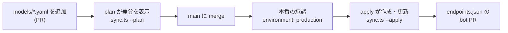
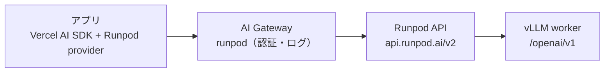
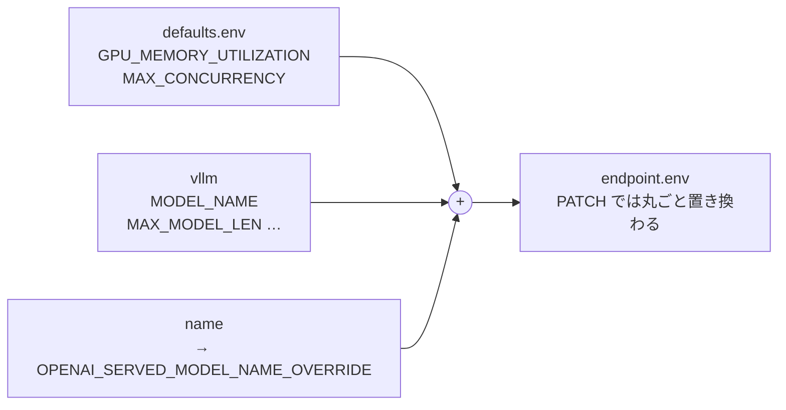

<div align="center">

# Loorel（ルーレル）

**YAML を 1 枚足すと、GPU エンドポイントができる。**

`models/*.yaml` を Runpod Serverless の vLLM エンドポイントに反映し、<br>
アプリからは Cloudflare AI Gateway 経由で呼び出します。

[Quickstart](#quickstart) · [Why](#why-loorel) · [しくみ](#しくみ) · [リファレンス](#リファレンス) · [FAQ](#よくある質問) · [ロードマップ](#ロードマップ)

`preview` · 実装 3 / 7

</div>

<table>
<tr>
<th>models/qwen3-8b.yaml</th>
<th>pnpm plan</th>
</tr>
<tr>
<td>

```yaml
name: qwen3-8b
gpu:
  pools: [ADA_24]
  count: 1
workers: { min: 0, max: 2 }
vllm:
  MODEL_NAME: Qwen/Qwen3-8B
  MAX_MODEL_LEN: "8192"
```

</td>
<td>

```diff
+ create qwen3-8b
+     image: "runpod/worker-v1-vllm:v2.27.2"
+     env.MODEL_NAME: "Qwen/Qwen3-8B"
+     env.MAX_MODEL_LEN: "8192"
+     gpu: {"pools":["ADA_24"],"count":1}
+     workers: {"min":0,"max":2}
```

</td>
</tr>
</table>

## Why Loorel

GPU の設定をコンソールで手作業するかわりに、リポジトリのファイルを正解にします。

|                 | 特長                         | 内容                                                                                                             |
| --------------- | ---------------------------- | ---------------------------------------------------------------------------------------------------------------- |
| `diff`          | **変更は PR で読める**       | plan が Runpod の今の状態と YAML を比べ、変わる項目だけを Markdown で出します。PR コメントにそのまま貼れる形です |
| `$0.00 / idle`  | **使わない間は課金されない** | `workers.min: 0` が標準です。リクエストが来たときだけ GPU が起動し、5 秒使われなければ止まります                 |
| `no state file` | **状態ファイルを持たない**   | エンドポイントを名前で探し、なければ作成、あれば更新します。Terraform の state のような管理物はありません        |
| `1 gateway`     | **入口は Gateway ひとつ**    | アプリは AI Gateway の URL だけを知っていれば動きます。認証・ログ・利用上限は Gateway 側でまとめて扱えます       |

## しくみ

### 反映の流れ



| #   | ステップ                                | 状態          |
| --- | --------------------------------------- | ------------- |
| 1   | `models/*.yaml` を追加して PR を作る    | ✅ 動く       |
| 2   | plan が差分を表示（`sync.ts --plan`）   | 🧪 テスト済み |
| 3   | main に merge                           | ⏳ 予定       |
| 4   | 本番の承認（`environment: production`） | ⏳ 予定       |
| 5   | apply が作成・更新（`sync.ts --apply`） | ⏳ 予定       |
| 6   | `endpoints.json` を更新する bot PR      | ⏳ 予定       |

### リクエストの通り道



Cloudflare 側の設定は最初の 1 回だけです。エンドポイント ID は URL のパスに入るので、モデルを増やしても Gateway は変えません。

## Quickstart

Gateway を用意して、1 つ目のモデルの plan を出すところまで。

| 必要なもの             | 内容                                                                     |
| ---------------------- | ------------------------------------------------------------------------ |
| Node.js                | 22.18 以上（TypeScript をそのまま実行します）                            |
| pnpm                   | パッケージ管理。lint・整形・テストは Vite+（`vp`）                       |
| `CLOUDFLARE_API_TOKEN` | 権限は AI Gateway の Read と Edit。セットアップのときだけ使います        |
| `RUNPOD_API_KEY`       | plan は Read Only のキーで動きます。apply は書き込みできるキーが必要です |

### 1. 依存を入れる

```sh
pnpm install
```

### 2. Gateway とカスタムプロバイダーを登録する ✅

引数なしで実行すると、作るものを表示するだけです。`--apply` を付けると、足りないものだけを作ります。すでにあるものは書き換えません。

```sh
export CLOUDFLARE_ACCOUNT_ID=... CLOUDFLARE_API_TOKEN=...
bash infra/cloudflare/setup.sh          # plan
bash infra/cloudflare/setup.sh --apply
```

```text
created gateway 'runpod'
created custom provider 'runpod' -> https://api.runpod.ai
endpoint URL: https://gateway.ai.cloudflare.com/v1/{account}/runpod/custom-runpod/v2/{endpointId}
```

### 3. モデルを 1 つ書く

ファイル名と `name` を揃えます。GPU はプール ID（例 `ADA_24`）で選びます。

```yaml
# models/qwen3-8b.yaml
name: qwen3-8b
gpu:
  pools: [ADA_24]
  count: 1
workers: { min: 0, max: 2 }
vllm:
  MODEL_NAME: Qwen/Qwen3-8B
  MAX_MODEL_LEN: "8192"
```

### 4. plan で差分を見る 🧪

Runpod には何も書き込みません。`--out plan.md` を付けると、PR コメント用の Markdown をファイルにも書きます。

```sh
RUNPOD_API_KEY=... pnpm plan
```

```diff
### Runpod plan
**1 to create, 0 to update, 0 unchanged, 0 without YAML**
+ create qwen3-8b
+     type: "QUEUE"
+     image: "runpod/worker-v1-vllm:v2.27.2"
+     disk: 50
+     env.GPU_MEMORY_UTILIZATION: "0.90"
+     env.MAX_CONCURRENCY: "30"
+     env.MODEL_NAME: "Qwen/Qwen3-8B"
+     env.MAX_MODEL_LEN: "8192"
+     env.OPENAI_SERVED_MODEL_NAME_OVERRIDE: "qwen3-8b"
+     gpu: {"pools":["ADA_24"],"excludedTypes":[],"count":1}
+     workers: {"min":0,"max":2,"idleTimeout":5}
+     scaling: {"type":"QUEUE_DELAY","queueDelay":4}
+     timeout: 600000
+     flashboot: "FLASHBOOT"
```

### 5. アプリから呼ぶ ⏳（`src/ai.ts` は予定）

エンドポイントごとに `baseURL` を作り、モデル名には YAML の `name` を渡します。AI SDK は v6 を使います。

```ts
import { createRunpod } from "@runpod/ai-sdk-provider";
import { generateText } from "ai";
import endpoints from "../endpoints.json";

const GATEWAY = `https://gateway.ai.cloudflare.com/v1/${ACCOUNT_ID}/runpod/custom-runpod`;

const runpod = createRunpod({
  apiKey: process.env.RUNPOD_API_KEY,
  baseURL: `${GATEWAY}/v2/${endpoints["qwen3-8b"].id}/openai/v1`,
  headers: { "cf-aig-authorization": `Bearer ${process.env.CF_AIG_TOKEN}` },
});

const { text } = await generateText({
  model: runpod("qwen3-8b"), // = OPENAI_SERVED_MODEL_NAME_OVERRIDE
  prompt: "こんにちは",
});
```

## リファレンス

### models/*.yaml

1 ファイルが 1 エンドポイントです。書いていない項目は [defaults.yaml](#defaultsyaml) の値になります。

| 項目                | 必須         | 既定値   | 意味                                                            |
| ------------------- | ------------ | -------- | --------------------------------------------------------------- |
| `name`              | 必須         | —        | エンドポイント名。小文字・数字・`-`。ファイル名と同じにする     |
| `gpu.pools`         | 必須         | —        | GPU プール ID の一覧（例 `ADA_24`）。空きがあるプールで起動する |
| `gpu.excludedTypes` | 任意         | `[]`     | プールから外す GPU の型（例 `NVIDIA L4`）                       |
| `gpu.count`         | 任意         | `1`      | 1 ワーカーあたりの GPU 数                                       |
| `workers.min`       | 必須         | —        | 常に起動しておく数。`0` なら待機中は課金なし                    |
| `workers.max`       | 必須         | —        | 同時に起動する上限                                              |
| `disk`              | 任意         | defaults | コンテナのディスク（GB）。モデルはここに落とす                  |
| `vllm.*`            | `MODEL_NAME` | —        | vLLM worker の環境変数。`MODEL_NAME` は必須                     |

#### 環境変数の組み立て

右に行くほど優先されます。モデル名は `name` から自動で入るので、アプリは YAML と同じ名前で呼べます。



### defaults.yaml

`infra/runpod/defaults.yaml` は全エンドポイント共通の設定です。Runpod のテンプレートのかわりにリポジトリで持ちます。

| 項目          | 今の値                          | 意味                                               |
| ------------- | ------------------------------- | -------------------------------------------------- |
| `image`       | `runpod/worker-v1-vllm:v2.27.2` | vLLM worker のイメージ。タグは必ず固定する         |
| `type`        | `QUEUE`                         | キュー型。`/run`・`/status`・`/openai/v1` が使える |
| `disk`        | `50`                            | コンテナのディスク（GB）                           |
| `flashboot`   | `FLASHBOOT`                     | 起動を速くする Runpod の機能                       |
| `timeout`     | `600000`                        | 1 リクエストの上限（ミリ秒）                       |
| `idleTimeout` | `5`                             | 何秒使われなければワーカーを止めるか               |
| `scaling`     | `QUEUE_DELAY 4`                 | キューの待ち時間でワーカーを増やす                 |
| `env`         | 2 件                            | 全モデル共通の vLLM 環境変数                       |

### plan の読み方

| 記号     | 意味                                    |
| -------- | --------------------------------------- |
| `+`      | 作成する                                |
| `!`      | 変わる項目だけ更新する                  |
| `-`      | YAML が消えた。`--prune` のときだけ削除 |
| （なし） | 変更なし                                |

更新の例:

```diff
**0 to create, 1 to update, 0 unchanged, 0 without YAML**
! update qwen3-8b (x7k2m9qwen)
!     env.MAX_MODEL_LEN: "4096" -> "8192"
!     workers.max: 1 -> 2
```

plan が止める設定:

| こうなっていたら                             | 理由                                                            |
| -------------------------------------------- | --------------------------------------------------------------- |
| 知らない GPU プール                          | Runpod のカタログ（`/v2/catalog/gpus`）にないものは起動できない |
| プール外の `excludedTypes`、全部を外す指定   | Runpod が 400 を返す、または GPU が 0 種類になる                |
| `TOKEN`・`SECRET`・`API_KEY` などを含む env  | 値が PR コメントに出てしまうため YAML には書かない              |
| `MODEL_NAME` がない、`min` > `max`           | ワーカーが起動できない                                          |
| 知らない項目名、ファイル名と `name` の不一致 | 書き間違いを早めに見つける                                      |
| Runpod 側に同じ名前のエンドポイントが 2 つ   | どちらを更新するか決められない                                  |

終了コードは `0` が成功、`1` が設定または API のエラー、`2` が使い方の誤りです。Runpod 側の値でも、秘密らしい名前の env は `(hidden)` と表示します。

### Gateway の URL

1 本の URL に、Cloudflare 側と Runpod 側の情報が並んでいます。

```text
https://gateway.ai.cloudflare.com/v1/{account}/runpod/custom-runpod/v2/{endpointId}/openai/v1/chat/completions
```

| 部分                         | 意味                                                      |
| ---------------------------- | --------------------------------------------------------- |
| `{account}`                  | Cloudflare のアカウント ID                                |
| `runpod`                     | Gateway の ID                                             |
| `custom-runpod`              | カスタムプロバイダー（slug `runpod` に `custom-` が付く） |
| `v2/{endpointId}`            | Runpod のエンドポイント                                   |
| `openai/v1/chat/completions` | vLLM の OpenAI 互換 API                                   |

転送先は `https://api.runpod.ai/v2/{endpointId}/openai/v1/chat/completions` です。

> [!IMPORTANT]
> **パスには必ず `/v2/` を入れる。** Gateway は、パスに `v`＋数字（`v1`・`v2` など）がないと、先頭に `/v1` を足します。そのためプロバイダーの `base_url` はドメインだけにして、呼び出す側が `/v2/` から書きます。

| Gateway に送るパス          | Runpod に届くパス           | 結果    |
| --------------------------- | --------------------------- | ------- |
| `/v2/{id}/run`              | `/v2/{id}/run`              | ✅ 届く |
| `/v2/{id}/status/{jobId}`   | `/v2/{id}/status/{jobId}`   | ✅ 届く |
| `/v2/{id}/openai/v1/models` | `/v2/{id}/openai/v1/models` | ✅ 届く |
| `/{id}/run`（v2 なし）      | `/v1/{id}/run`              | ❌ 404  |

## よくある質問

<details>
<summary><b>なぜ Runpod のテンプレートを使わないのですか</b></summary>

Runpod REST API v2 では、テンプレートはエンドポイントを作るときに 1 回コピーされるだけです。あとでテンプレートを直してもエンドポイントには届きません。共通の設定は `defaults.yaml` に置き、毎回エンドポイントへ直接送ります。

</details>

<details>
<summary><b>どの Runpod API を使っていますか</b></summary>

REST API v2（`https://api.runpod.io/v2`）です。v1 は 2026 年 11 月 15 日に終了します。

</details>

<details>
<summary><b>YAML を消すとエンドポイントも消えますか</b></summary>

消えません。plan に「YAML removed」と表示されるだけです。削除は apply に `--prune` を付けたときだけ行います。対象は `endpoints.json` に載っているエンドポイントに限ります。

</details>

<details>
<summary><b>GPU の型名で指定できますか</b></summary>

v2 では GPU をプール単位で選びます。特定の型だけにしたいときは、同じプールの他の型を `excludedTypes` に並べます。プールの一覧は Runpod の `GET /v2/catalog/gpus` で確認できます。

</details>

<details>
<summary><b>HF_TOKEN のような秘密はどこに置きますか</b></summary>

今の版では YAML に書けません。値が PR コメントに出るのを防ぐためです。gated モデルを使うときは、GitHub Secrets から apply に渡す仕組みを足します（未実装）。

</details>

<details>
<summary><b>モデル名に endpoint ID を渡さないのはなぜですか</b></summary>

Runpod の AI SDK provider は、モデル ID をそのまま vLLM へのリクエストの `model` に入れます。vLLM は自分の配信名しか受け付けないので、worker の `OPENAI_SERVED_MODEL_NAME_OVERRIDE` に YAML の `name` を入れ、その名前で呼びます。

</details>

## ロードマップ

実装は番号の順に、動作を確かめてから次へ進みます。

| #   | 内容                                                        | 状態                             |
| --- | ----------------------------------------------------------- | -------------------------------- |
| 1   | `infra/cloudflare/setup.sh`：Gateway とカスタムプロバイダー | ✅ 動作確認済み                  |
| 2   | 共通設定の持ち方（`defaults.yaml`）                         | ✅ 決定                          |
| 3   | `sync.ts --plan`：検証と差分                                | 🧪 テスト 15 件・実 API 確認待ち |
| 4   | `sync.ts --apply`：作成・更新と `endpoints.json`            | ⏳ 予定                          |
| 5   | GitHub Actions：PR で plan、main で apply                   | ⏳ 予定                          |
| 6   | `endpoints.json` の bot PR                                  | ⏳ 予定                          |
| 7   | `src/ai.ts`：Gateway 経由で 1 回呼ぶ                        | ⏳ 予定                          |

## 開発

```sh
pnpm exec vp check     # 整形・lint・型チェック
pnpm exec vp test run  # テスト
```

commit の前に `vp check --fix` が自動で動きます（`.vite-hooks/pre-commit`）。

---

MIT License · Runpod REST API v2 · Cloudflare AI Gateway · Vercel AI SDK v6 · Vite+
